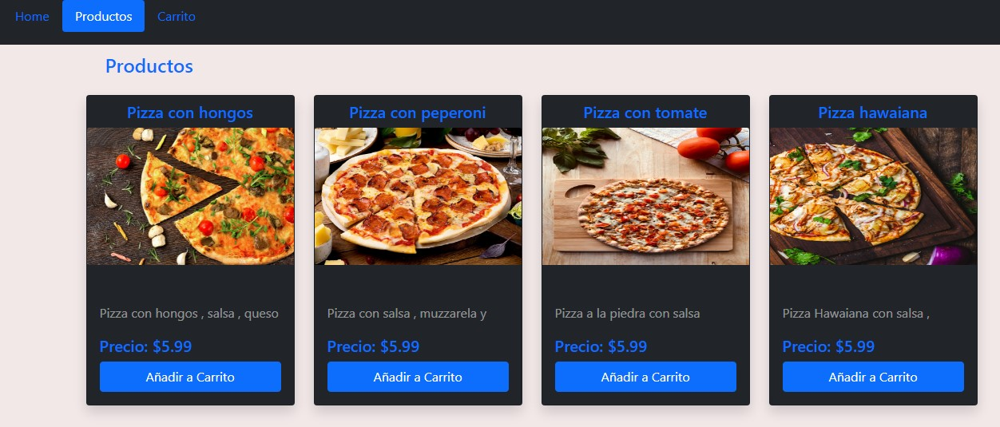
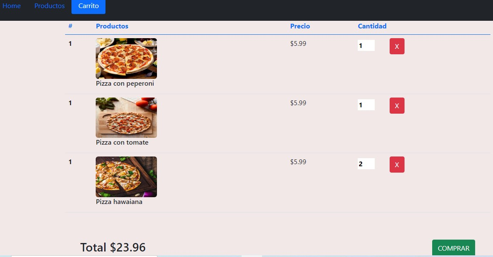

# Carrito-de-compras
<h2>Carrito de compras con HTML  ,CSS,  Javascript , Jquery  y Bootstrap</h2>

Tarjetas y pestañas de  Bootstrap , con descripcion de los productos escondida y diseño responsivo.
 

Para darle funcionalidad a los botones tomando la clase, use document.QuerySelectorAll.Para evaluar si se cumplia el evento click , use el metodo forEach para recorrer los botones y el addEventlistener para ver cuando se ejecuta el evento ,para saber que boton fue clickeado utilize evento.target.Para agregar nuevos productos al carrito utilize el metodo push y para que no haya espacios en blanco en los titulos de los productos cuando se muestren en la pestaña productos use el metodo trim . 

